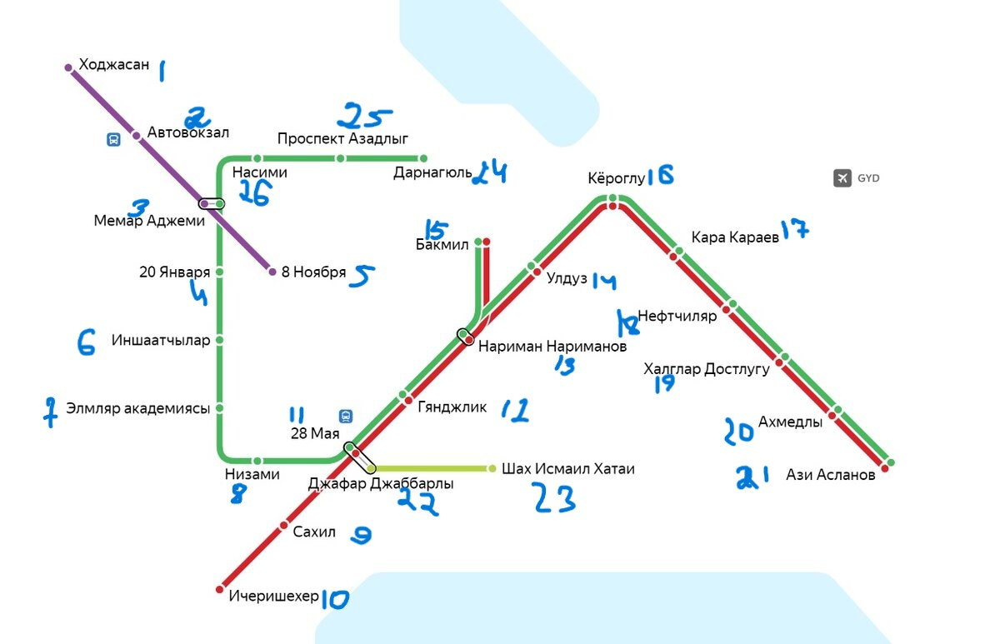

---

# Metro Simulator 🚇

Добро пожаловать в **Metro Simulator** — многопоточную симуляцию метро, написанную на C++! Этот проект моделирует движение поездов по линиям метро, управляет пассажиропотоком и эмулирует хаотичную жизнь станций с помощью мьютексов, потоков и случайных событий. Если вы когда-либо хотели заглянуть под капот метрополитена или просто насладиться кодом с криками "KANARA CYAKIN" и "AY ADAM XƏTTİN ARXASINDA DUR", этот проект для вас!

## ✨ Особенности
- **Многопоточность**: Каждый поезд работает в собственном потоке, обеспечивая параллельное движение.
- **Цветные линии метро**: Поддержка линий RED, GREEN, PURPLE и YELLOW с динамическими связями между станциями.
- **Управление пассажирами**: Случайный приток и отток людей на станциях с учетом их вместимости.
- **Реалистичная симуляция**: Поезда ждут освобождения станций, разворачиваются на конечных точках и даже отправляются в депо.
- **JSON-конфигурация**: Станции и их связи загружаются из файла `stations.json` для гибкой настройки сети метро.
- **Атмосфера**: Вывод в консоль с "неразборчивыми голосами" и эмоциональными выкриками машинистов добавляет колорит.
## 🚀 Сборка и запуск

Вы можете собрать проект несколькими способами: 

### 1. Сборка в CLion
Для запуска необходимо добавить файл stations.json в папку cmake-build-debug
1. Откройте проект в CLion.
2. Нажмите кнопку **Run** для автоматической сборки и запуска программы.

### 2. Сборка вручную через терминал

#### Статическая сборка:

1. Убедитесь, что в `CMakeLists.txt` указаны настройки статической линковки.
2. Выполните команды:

```bash
cmake -S . -B build
```

3.
```bash
cd build
make
```

После этого будет создан исполняемый файл в текущей папке.


#### Динамическая сборка:

Аналогично статической, но с включением `BUILD_SHARED_LIBS=ON` в `CMakeLists.txt`.

---
## 🗺 Карта метрополитена
Ниже представлена карта метро, которую симулирует этот проект. Она включает станции и линии, загружаемые из `stations.json`.


## 📝 Пример `stations.json`
```json
[
    {
        "id": 0,
        "name": "Start Station",
        "square": 500,
        "last": false,
        "depo": false,
        "next": [{"id": 1, "line": "PURPLE"}],
        "prev": []
    },
    {
        "id": 1,
        "name": "Middle Station",
        "square": 300,
        "last": false,
        "depo": false,
        "next": [{"id": 2, "line": "PURPLE"}],
        "prev": [{"id": 0, "line": "PURPLE"}]
    },
    {
        "id": 2,
        "name": "End Station",
        "square": 400,
        "last": true,
        "depo": false,
        "next": [],
        "prev": [{"id": 1, "line": "PURPLE"}]
    }
]
```

- `id`: Уникальный идентификатор станции.
- `name`: Название станции.
- `square`: Площадь станции (влияет на максимальное количество людей).
- `last`: Является ли станция конечной (поезд разворачивается).
- `depo`: Является ли станция депо.
- `next`/`prev`: Список следующих и предыдущих станций с указанием линий.

## 🏃‍♂️ Как это работает?
- **Станции**: Каждая станция имеет ID, имя, площадь, максимальное число пассажиров и связи с другими станциями. Пассажиры приходят и уходят случайным образом.
- **Поезда**: Поезда движутся по заданной линии, перевозят пассажиров, ждут освобождения станций и разворачиваются на конечных точках.
- **Мьютексы**: Используются для предотвращения столкновений поездов на станциях (по одному для каждого направления).
- **Случайность**: Пассажиропоток и выбор маршрута (например, на станции "Нариманов") добавляют элемент непредсказуемости.

## 🎉 Пример вывода
```
Station 0 now has 23 people
(Left_side) Train with id:3 arrived at the station Start Station(0)
*unreadable voice "GATARA DUSHMAYA TALASIN."*
23 passengers exited at station 0
15 passengers boarded at station 0
(Left_side) Train with id:3 left the station Start Station(0)
*shouting with aggression*"KANARA CYAKIN"
"AY ADAM XƏTTİN ARXASINDA DUR"*
```

---

Создано с ❤️ и чашкой кофе в марте 2025 года.  
Пусть ваши поезда всегда приходят вовремя! 🚆

---
