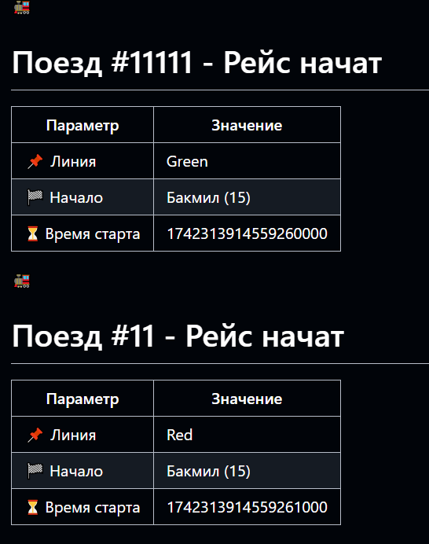
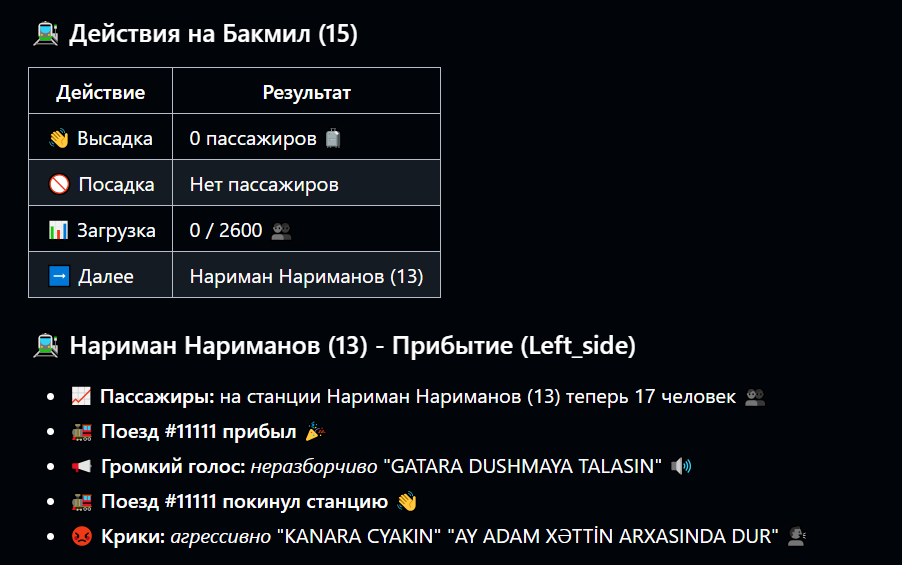

# Metro Simulator 🚇

Добро пожаловать в **Metro Simulator** — многопоточную симуляцию метро на C++! Этот проект моделирует движение поездов по линиям метро, управляет пассажиропотоком и эмулирует хаотичную жизнь станций с помощью мьютексов, потоков и случайных событий. Если вы хотите заглянуть под капот метрополитена или просто насладиться кодом с криками "KANARA CYAKIN" и "AY ADAM XƏTTİN ARXASINDA DUR", этот проект для вас!

---

## Содержание
- [Особенности](#особенности)
- [Сборка и запуск](#сборка-и-запуск)
  - [Сборка в CLion](#сборка-в-clion)
  - [Сборка вручную через терминал](#сборка-вручную-через-терминал)
- [Карта метрополитена](#карта-метрополитена)
- [Пример `stations.json`](#пример-stationsjson)
- [Пример вывода](#пример-вывода)
- [Как это работает?](#как-это-работает)
- [Планы на будущее](#планы-на-будущее)

---

## ✨ Особенности
- **Многопоточность**: Каждый поезд работает в своём потоке для параллельного движения.
- **Цветные линии метро**: Поддержка линий RED, GREEN, PURPLE и YELLOW с динамическими связями.
- **Управление пассажирами**: Случайный приток и отток людей с учётом вместимости станций.
- **Реалистичная симуляция**: Поезда ждут освобождения станций, разворачиваются на конечных точках и уходят в депо.
- **JSON-конфигурация**: Станции загружаются из файла `stations.json` для гибкой настройки.
- **Атмосфера**: Вывод с "неразборчивыми голосами" и выкриками добавляет колорит.

[К содержанию](#содержание)

---

## 🚀 Сборка и запуск

Вы можете собрать проект двумя способами:

### Сборка в CLion
1. Откройте проект в CLion.
2. Добавьте файл `stations.json` в папку `cmake-build-debug`.
3. Нажмите **Run** для сборки и запуска.

### Сборка вручную через терминал

#### Статическая сборка
1. Убедитесь, что в `CMakeLists.txt` настроена статическая линковка.
2. Выполните:
   ```bash
   cmake -S . -B build
   cd build
   make
   
3. Исполняемый файл появится в папке `build`.

#### Динамическая сборка
Аналогично статической, но добавьте `BUILD_SHARED_LIBS=ON` в `CMakeLists.txt`.

[К содержанию](#содержание)

---

## 🗺 Карта метрополитена
Карта метро, которую симулирует проект. Станции и линии загружаются из `stations.json`.


[К содержанию](#содержание)

---

## 📝 Пример `stations.json`
```json
[
    {
        "id": 0,
        "name": "Start Station",
        "square": 500,
        "last": false,
        "depo": false,
        "next": [{"id": 1, "line": "PURPLE"}],
        "prev": []
    },
    {
        "id": 1,
        "name": "Middle Station",
        "square": 300,
        "last": false,
        "depo": false,
        "next": [{"id": 2, "line": "PURPLE"}],
        "prev": [{"id": 0, "line": "PURPLE"}]
    },
    {
        "id": 2,
        "name": "End Station",
        "square": 400,
        "last": true,
        "depo": false,
        "next": [],
        "prev": [{"id": 1, "line": "PURPLE"}]
    }
]
```
- `id`: Уникальный ID станции.
- `name`: Название станции.
- `square`: Площадь (влияет на вместимость).
- `last`: Конечная станция (поезд разворачивается).
- `depo`: Депо или нет.
- `next`/`prev`: Связи с другими станциями.

[К содержанию](#содержание)

---

## 🎉 Пример вывода

Вывод запуска поезда:



Информация о станции и прибывшем поезде:



[К содержанию](#содержание)

---

## 🏃‍♂️ Как это работает?
- **Станции**: Хранят ID, имя, вместимость и связи. Пассажиры приходят/уходят случайно.
- **Поезда**: Ездят по линиям, перевозят людей, ждут станции и разворачиваются на концах.
- **Мьютексы**: Не дают поездам столкнуться на станциях.
- **Случайность**: Пассажиры и маршруты (например, на "Нариманов") добавляют хаос.

### Класс `Station`
- **Поля**: ID, имя, площадь, пассажиры, связи, мьютексы.
- **Методы**:
  - `TryArriveTrain`: Проверяет, свободна ли станция, и обрабатывает прибытие.
  - `updatePassengers`: Меняет число людей случайно.
  - `getNextForLine`/`getPrevForLine`: Дают следующую/предыдущую станцию.

### Класс `Train`
- **Поля**: ID, начальная станция, направление, линия, пассажиры.
- **Методы**:
  - `runTrain`: Управляет движением и пассажирами.
  - `getLineName`/`getLineColor`: Возвращают имя и цвет линии.

### `main.cpp`
1. Читает `stations.json`.
2. Спрашивает данные о поездах.
3. Запускает поезда в потоках.
4. Пишет всё в `trips.md`.

[К содержанию](#содержание)

---

## Планы на будущее
- Добавить визуализацию метро.
- Умные пассажиры (зависимость от времени суток).
- Сложные маршруты.
- Внутреннее время и частота поездов.

[К содержанию](#содержание)

---

Создано с ❤️ и кофе в марте 2025 года.  
Пусть ваши поезда всегда приходят вовремя! 🚆
```
